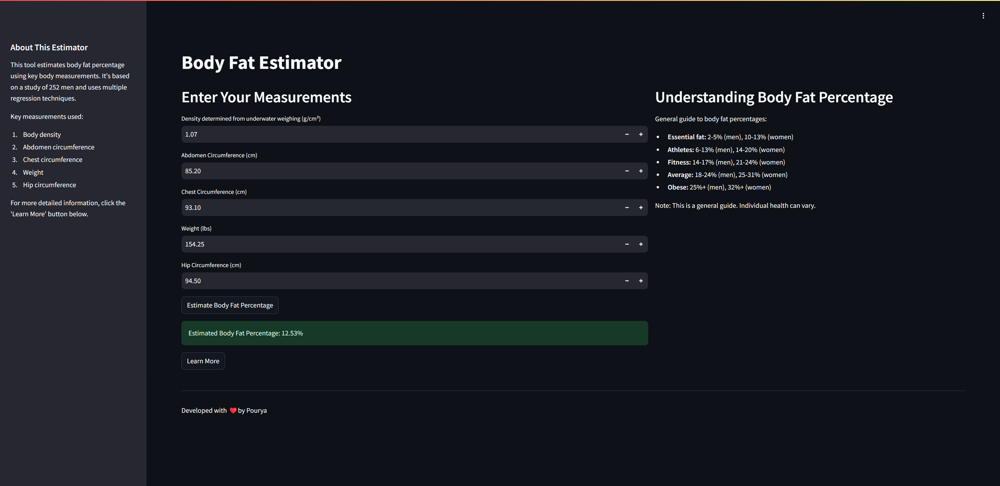

# Body Fat Estimator



## Project Overview

The Body Fat Estimator is a machine learning project that predicts body fat percentage based on various body measurements. This project uses a Linear Regression model to estimate body fat and provides a user-friendly web interface built with Streamlit, allowing users to input their measurements and receive an instant body fat estimate.

The estimator is based on a study of 252 men and uses multiple regression techniques to provide accurate body fat predictions. The model takes into account key measurements such as body density (determined from underwater weighing), abdomen circumference, chest circumference, weight, and hip circumference.

This project demonstrates the application of machine learning in creating a practical tool for health and fitness applications. It serves as an excellent example of an end-to-end data science project, from data preprocessing and model training to deploying a web application with multiple hosting options.

The Body Fat Estimator not only provides predictions but also offers educational information about body fat percentages, their significance, and the science behind the estimation method. This makes it a valuable tool for both individuals interested in their health metrics and professionals in the fitness and healthcare industries.

## Table of Contents

1. [Dataset](#dataset)
2. [Model Training](#model-training)
3. [Streamlit Application](#streamlit-application)
4. [Deployment Options](#deployment-options)
5. [File Structure](#file-structure)
6. [Usage](#usage)

## Dataset

The dataset used for this project contains the following attributes:

1. Density determined from underwater weighing
2. Percent body fat from Siri's (1956) equation
3. Age (years)
4. Weight (lbs)
5. Height (inches)
6. Neck circumference (cm)
7. Chest circumference (cm)
8. Abdomen 2 circumference (cm)
9. Hip circumference (cm)
10. Thigh circumference (cm)
11. Knee circumference (cm)
12. Ankle circumference (cm)
13. Biceps (extended) circumference (cm)
14. Forearm circumference (cm)
15. Wrist circumference (cm)

The dataset can be downloaded from [Kaggle](https://www.kaggle.com/fedesoriano/body-fat-prediction-dataset).

## Model Training

The model training process is detailed in the `Body_Fat_Estimator.ipynb` notebook. This notebook covers data preprocessing, exploratory data analysis, and the implementation of the Linear Regression model for body fat estimation.

## Streamlit Application

The Streamlit application is defined in `app/app.py`. It provides a user interface for inputting body measurements and viewing the estimated body fat percentage. The application also includes additional information about body fat percentages and the estimation method.

## Deployment Options

There are four ways to deploy and use this application:

1. **Run Locally**:
   - Clone the repository:
     ```
     git clone https://github.com/pouryare/body_fat_estimator.git
     cd body_fat_estimator
     ```
   - Navigate to the `app` directory: `cd app`
   - Install requirements: `pip install -r requirements.txt`
   - Run the Streamlit app: `streamlit run app.py`
   - Open a web browser and go to `http://localhost:8501`

2. **Deploy on Heroku**:
   - Create a Heroku account and install the Heroku CLI.
   - Navigate to the root directory of the project.
   - Initialize a Git repository and commit your files.
   - Create a new Heroku app: `heroku create body-fat-estimator`
   - Push your code to Heroku: `git push heroku master`

3. **Use Docker**:
   - Pull the image from Docker Hub: `docker pull pouryare/body_fat_estimator`
   - Run the container: `docker run -p 8501:8501 pouryare/body_fat_estimator`

   Alternatively, you can build the image locally:
   - Build the Docker image: `docker build -t pouryare/body_fat_estimator ./app`
   - Run the container: `docker run -p 8501:8501 pouryare/body_fat_estimator`

4. **Deploy on Azure Cloud**:
   - Have an Azure account with an active subscription. [Create an account for free](https://azure.microsoft.com/free/?ref=microsoft.com&utm_source=microsoft.com&utm_medium=docs&utm_campaign=visualstudio).
   - Install [Python 3.6 or higher](https://www.python.org/downloads/).
   - Install the [Azure CLI](https://docs.microsoft.com/en-us/cli/azure/install-azure-cli).
   - Sign in to Azure: `az login`
   - Clone the repository (if not done already):
     ```
     git clone https://github.com/pouryare/body_fat_estimator.git
     cd body_fat_estimator
     ```
   - Navigate to the `app` directory: `cd app`
   - Create and activate a virtual environment:
     ```
     py -3 -m venv .venv
     .venv\scripts\activate
     ```
   - Install requirements: `pip install -r requirements.txt`
   - Deploy the web app:
     ```
     az webapp up --sku B1 --name body-fat-estimator
     ```
   - Access your app at the URL provided in the output (e.g., http://body-fat-estimator.azurewebsites.net).

## File Structure

```
body_fat_estimator/
├── app/
│   ├── app.py
│   ├── Dockerfile
│   ├── lr.joblib
│   └── requirements.txt
├── Body_Fat_Estimator.ipynb
├── Procfile
├── README.md
└── screenshot.png
```

## Usage

1. Open the application (either locally, on Heroku, via Docker, or on Azure).
2. Enter your body measurements in the input fields provided.
3. Click the "Estimate Body Fat Percentage" button to view your estimated body fat percentage.
4. Explore additional information about body fat percentages and the estimation method by clicking the "Learn More" button.

---

This project demonstrates the application of machine learning in creating a body fat estimation tool with a web application interface and multiple hosting options. It serves as an excellent example of an end-to-end data science project with practical applications in health and fitness.

For any issues or suggestions, please open an issue on the [GitHub repository](https://github.com/pouryare/body_fat_estimator).
